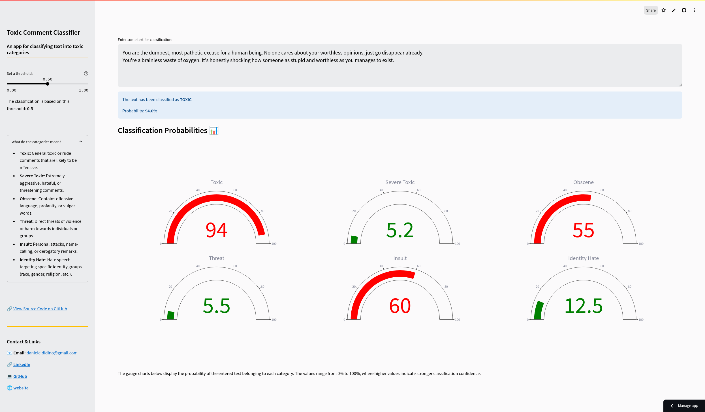

<h1 align="center">Toxic Language Classifier</h1>

<p align="center">A lightweight model for Detecting Toxic Language</p>

### The Streamlit App is available here:
[](https://h79wmnxbmimkvqem9wnwp2.streamlit.app/)

<!-- TABLE OF CONTENTS -->
<details>
  <summary>Table of Contents</summary>
  <ol>
    <li>
      <a href="#about-the-project">About The Project</a>
      <ul>
        <li><a href="#what-is-multilabel-classification">What is Multilabel Classification?</a></li>
        <li><a href="#data">Data</a></li>
      </ul>
    </li>
    <li>
      <a href="#model-architecture">Model Architecture</a>
      <ul>
        <li><a href="#architecture-overview">Architecture Overview</a></li>
        <li><a href="#why-cnngru">Why CNN+GRU?</a></li>
        <li><a href="#key-benefits">Key Benefits</a></li>
        <li><a href="#weights--biases">Weights & Biases</a></li>
        <li><a href="#performance">Performance</a></li>
        <li><a href="#estimated-memory-usage-in-ram">Estimated Memory Usage in RAM</a></li>
      </ul>
    </li>
    <li>
      <a href="#installation">Installation</a>
      <ul>
        <li><a href="#1-clone-the-repository">1. Clone the Repository</a></li>
        <li><a href="#2-create-a-virtual-environment">2. Create a Virtual Environment</a></li>
        <li><a href="#3-activate-the-virtual-environment-and-install-dependencies">3. Activate the Virtual Environment and Install Dependencies</a></li>
        <li><a href="#4-run-the-streamlit-app-locally">4. Run the Streamlit App Locally</a></li>
        <li><a href="#5-deactivate-the-virtual-environment">5. Deactivate the Virtual Environment</a></li>
      </ul>
    </li>
  </ol>
</details>

## About the Project

<p align="center">

</p>

Thank you for your interest in this project!

In this project, I aimed to build an efficient, lightweight model capable of accurately classifying toxic content while requiring minimal computational resources.
The model performs multilabel classification, meaning it can assign multiple labels to a single text based on its content.
It is deployed in a Streamlit app, as shown in the screenshot above.

### What is Multilabel Classification?

Multilabel classification is a task where each input instance (in this case, a text comment) can be assigned multiple labels simultaneously.
This is in contrast to traditional single-label classification, where each instance belongs to just one class.

Key Concepts of multilabel classification:
- **Multiple Labels**: Each comment can have more than one label. For instance, a toxic comment may be tagged with both "threat" and "identity hate".
- **Independent Labels**: The labels are not mutually exclusive, meaning a comment can belong to any combination of labels, including none at all.

### Data

The dataset used in this project is from the [Toxic Comment Classification Challenge](https://www.kaggle.com/c/jigsaw-toxic-comment-classification-challenge) on Kaggle.
It contains a large set of Wikipedia comments that have been manually labeled for various types of toxic behavior.

**Dataset Variables**:
- **id**: Unique identifier for each comment
- **comment_text**: The text of the comment
- **toxic**: Binary (True/False) — Whether the comment is toxic
- **severe_toxic**: Binary (True/False) — Whether the comment is severely toxic
- **obscene**: Binary (True/False) — Whether the comment is obscene
- **threat**: Binary (True/False) — Whether the comment contains a threat
- **insult**: Binary (True/False) — Whether the comment is insulting
- **identity_hate**: Binary (True/False) — Whether the comment expresses identity hate

## Model Architecture

Given the relatively small dataset of 100K samples and short text, a CNN+GRU hybrid model was chosen for this task, as it balances performance and efficiency.

### Architecture Overview

- **Embedding Layer**: Converts input text into dense vectors of fixed size.
- **CNN Layer**:
  - **Conv1D**: Applies convolutional filters to capture local patterns (e.g., n-grams).
  - **Pooling Layer**: Reduces dimensionality while preserving key features.
- **GRU Layer**: Captures long-range dependencies and contextual information within the sequential data.
- **Dropout Layer**: Helps prevent overfitting by randomly setting a fraction of input units to zero during training.
- **Dense Layers**: Produces the final classification decision.

### Why CNN+GRU?

- **CNN**: Effective at identifying local patterns (like n-grams) within text. It serves as a feature extractor, focusing on important phrases for classification.
- **GRU**: Ideal for processing sequential data and understanding long-range dependencies, crucial for capturing context and meaning.

### Key Benefits

- **Feature Extraction**: The CNN extracts important local features (n-grams) before passing them to the GRU, which focuses on sequential dependencies.
- **Efficiency**: Pooling in the CNN reduces the sequence length, enabling the GRU to process fewer time steps, speeding up training.
- **Empirical Performance**: CNN+GRU architectures often outperform other combinations (e.g., GRU-CNN) in text classification tasks.

### Weights & Biases

The hyperparameter search was conducted using **Weights & Biases**.
The search results for the selected CNN+GRU model, as well as for other models that were not chosen, can be found [here](https://wandb.ai/daniele-didino/toxic_comment_clf).

**Hyperparameters Search**
- **Embedding Dimension**: Size of the word embedding vectors (typical range: 50-300).
- **Number of Filters**: Number of filters in the CNN (typical range: 64-256).
- **Kernel Size**: Size of the convolutional kernel, capturing different n-gram patterns (typical range: 3-7).
- **GRU Hidden Size**: Number of features in the GRU's hidden state (typical range: 50-200).
- **Learning Rate**: Controls the step size during training (typical range: 0.0001-0.01).
- **Batch Size**: Number of samples per batch during training (typical range: 16-128).
- **Dropout Rate**: Prevents overfitting by randomly dropping units during training (typical range: 0.2-0.5).

**Selected Hyperparameters**:
- **Embedding Dimension**: 50
- **Number of Filters**: 128
- **Kernel Size**: 3
- **GRU Hidden Size**: 64
- **Learning Rate**: 0.0008
- **Batch Size**: 16
- **Dropout Rate**: 0.3

### Performance

Performance is measured using ROC AUC (Receiver Operating Characteristic - Area Under the Curve) on the test set.

**What is ROC AUC?**

ROC AUC is a metric used to evaluate the performance of classification models. It measures the area under the ROC curve, which plots the true positive rate (TPR) against the false positive rate (FPR) at various threshold settings. The ROC AUC score ranges from 0 to 1, where:

- 1 indicates a perfect classifier
- Closer to 1 means better classification performance
- 0.5 suggests the model performs no better than random guessing

|         | Overall | toxic  | severe_toxic | obscene | threat | insult | identity_hate |
|---------|---------|--------|--------------|---------|--------|--------|---------------|
| ROI AUC | 0.95895 | 0.9705 | 0.9860       | 0.9865  | 0.9557 | 0.9777 | 0.9533        |

These high ROC AUC scores indicate that the model effectively distinguishes between toxic and non-toxic comments across different categories.

### Estimated Memory Usage in RAM

The approximate memory usage of the model when loaded is estimated by counting the number of parameters and their data type.

|                        |           |
|------------------------|-----------|
| Total Parameters       | 9,305,748 |
| Estimated Memory Usage | 35.50 MB  |

## Installation

#### Python Version: 3.10.12

#### 1. Clone the Repository

Clone the repository using either SSH or HTTPS:

- Using SSH:
```bash
git clone git@github.com:DanieleDidino/toxic_comment_clf.git
```

- Using HTTPS:
```bash
git clone https://github.com/DanieleDidino/toxic_comment_clf.git
```

#### 2. Create a Virtual Environment

```bash
python3 -m venv .venv
```

#### 3. Activate the Virtual Environment and Install Dependencies

The `requirements.txt` file includes the necessary dependencies for running the Streamlit app and deploying it on the cloud.

To run the notebooks (e.g., EDA, model retraining), you will need to uncomment the necessary packages in `requirements.txt`.
For example, `torch` is used only for training the models, so it is commented out in the file (it is not required for running the app).

```bash
source .venv/bin/activate
pip install -r requirements.txt
```

#### 4. Run the Streamlit App Locally
   
```bash
streamlit run app.py
```

#### 5. Deactivate the Virtual Environment

To stop the app, press `Ctrl + C`, and then deactivate the virtual environment:

```bash
deactivate
```
